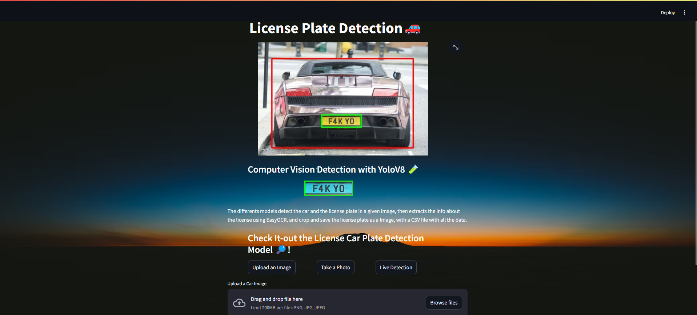
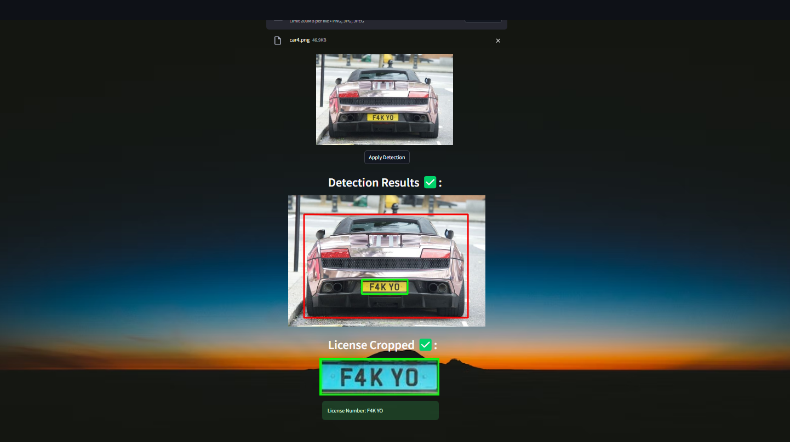

# License Plate Recognition 🚗

## License Plate Detection and Extraction with YoloV8 and EasyOCR

Using both the `COCO Model` to detect the vehicles and the `License Plate Model` to recognize the plate, and then with EasyOCR to extract the info from the cropped plate image.

## Instruction
- Create a Virtual Environment and install the packages mentioned in the `required.txt` file
- ## USE COMMAND PROMPT : 
- 

## Run
streamlit run app.py
Test it by running the `app.py` file, built with `Streamlit`.

## Resources
- Licenses Plates Dataset: https://universe.roboflow.com/roboflow-universe-projects/license-plate-recognition-rxg4e/dataset/41
- 
- 
